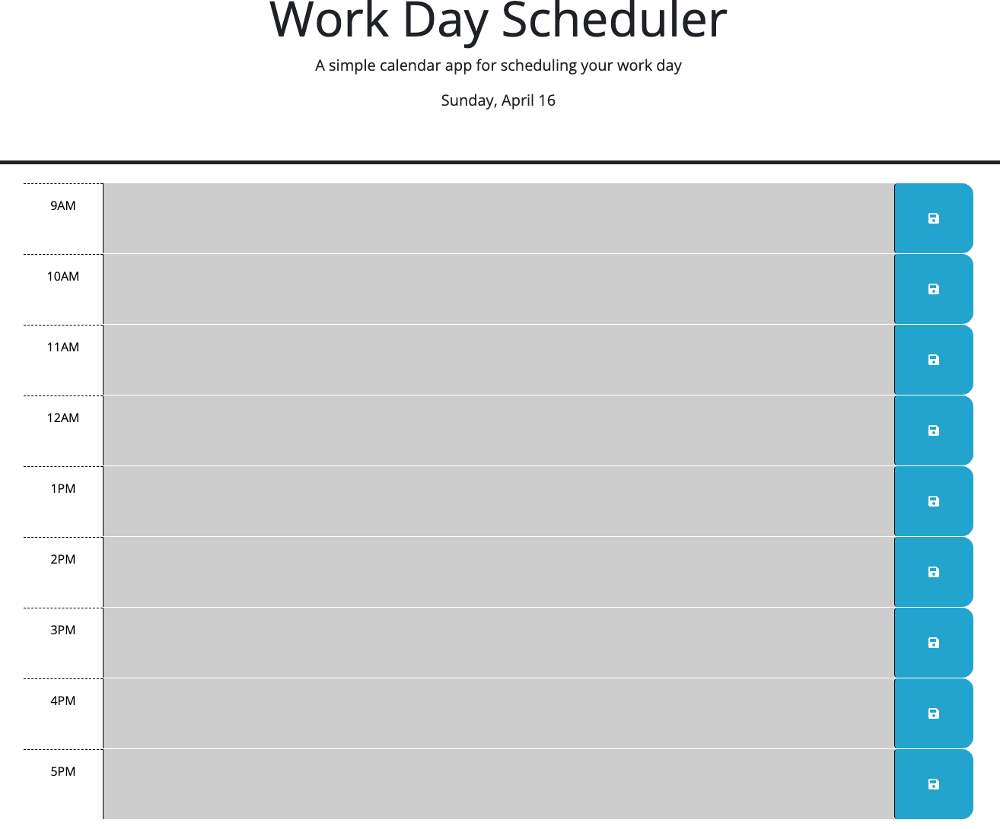

# Work Day Scheduler

## Description

In this challenge I needed to use jQuery and dayjs to complete. My most challenging part of this  
challenge was learning to implement local storage, but 
by pushing past the struggle I have learnt a more in depth understanding of local storage which for  
me was a huge leap forward! I am now much more confident in 
my abilities to use and implement local storage in future challenges and projects! Basically this  
project now has color coded time blocks for each hour for when 
the normal work hour is past, present, or future. Also the current date is now in the header of  
the website and the user can now type in which ever event they 
need to that is within normal business hours, and if they exit the page or refresh the page the  
events are still shown in their work day scheduler. In order for the new events that the user 
wants to add to be saved, the user can use the save button to save the event to keep for  
the future.

## ScreenShot

Link to site:  <a href=https://garciajv86.github.io/work_day_scheduler alt='Work Day Scheduler'>Work Day Scheduler</a>

## User Story

- AS AN employee with a busy schedule
- I WANT to add important events to a daily planner
- SO THAT I can manage my time effectively

## Acceptance Criteria

- GIVEN I am using a daily planner to create a schedule
- WHEN I open the planner
- THEN the current day is displayed at the top of the calendar
- WHEN I scroll down
- THEN I am presented with time-blocks for standard business hours
- WHEN I view the time-blocks for that day
- THEN each time-block is color coded to indicate whether it is in the past, present, or future
- WHEN I click into a time-block
- THEN I can enter an event
- WHEN I click the save button for that time-block
- THEN the text for that event is saved in local storage
- WHEN I refresh the page
- THEN the saved events persist

#### Author

Joshua V. Garcia